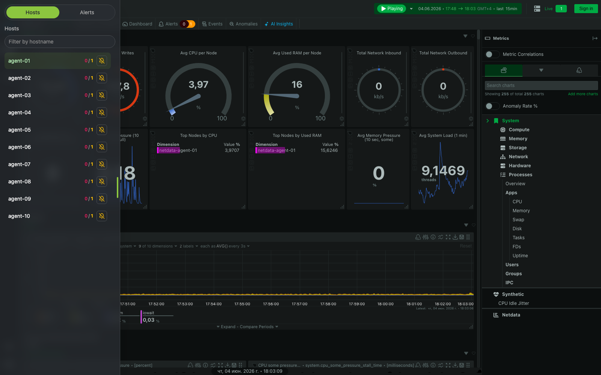
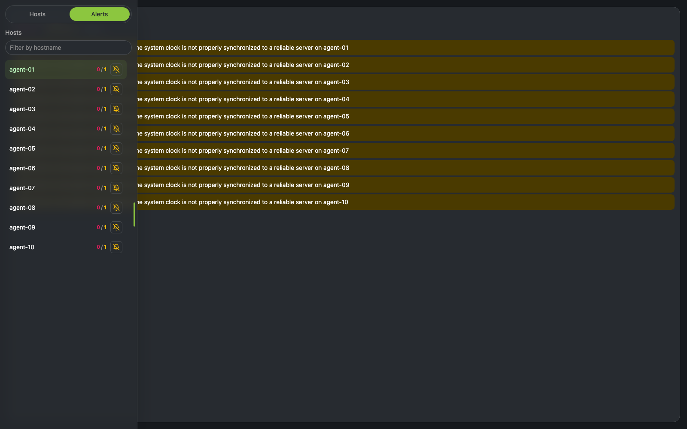

# Netdata Portal

Single-page portal for viewing several Netdata agents through one authenticated UI.
It keeps Netdata API tokens in the backend, proxies dashboards through a host
whitelist, aggregates alerts, and can silence or re-enable Netdata notifications
per host.

## Screenshots





## Features

- Full Netdata dashboard per configured host, loaded through `/api/proxy/<host>/`.
- Sliding host sidebar with per-host `critical / warning` counters.
- Unified alerts view across all configured hosts.
- Per-host notification control via Netdata Health Management API.
- Optional LDAP auth, suitable for FreeIPA/OpenLDAP-style deployments.
- Backend-only management token handling; frontend never receives the token.
- CSP and proxy redirect guard for proxied Netdata UI external calls.
- Hot-reloaded `config/hosts.txt`.
- Disposable local stand with 10 Netdata agents.

## Quick Start

```bash
cp .env.example .env
docker compose up -d --build
open http://localhost:3000
```

Hosts are read from `config/hosts.txt`. Each line is either a Netdata URL or
`URL|display-name`:

```text
http://prod-01:19999|prod-01
http://prod-02:19999|prod-02
```

Empty lines and lines starting with `#` are ignored. Changes are picked up
without restarting the backend.

## Local Stand

Run the portal with 10 disposable Netdata agents:

```bash
docker compose -f docker-compose.stand.yml up -d --build
open http://localhost:3000
```

Stop it with:

```bash
docker compose -f docker-compose.stand.yml down
```

The stand uses a fake management key from `config/netdata-management.stand.key`.
Do not reuse it outside local testing.

## Configuration

Main variables are in `.env.example`:

```bash
HOSTS_FILE=config/hosts.txt
ALERT_POLL_INTERVAL=15
REQUEST_TIMEOUT=5
```

Notification management is disabled by default. Enable it only on the backend:

```bash
NETDATA_MANAGEMENT_ENABLED=true
NETDATA_MANAGEMENT_API_TOKEN_FILE=/run/secrets/netdata_management_api_token
```

For Compose, put the real token in `secrets/netdata_management_api_token` and
keep `./secrets` mounted read-only. `NETDATA_MANAGEMENT_API_TOKEN` also works
for local non-container runs, but file-based secrets are preferred.

## Authentication

LDAP auth is disabled by default:

```bash
AUTH_ENABLED=false
```

To enable it, set `AUTH_ENABLED=true` and configure:

```bash
LDAP_URL=ldaps://ipa.example.com:636
LDAP_USER_BASE_DN=cn=users,cn=accounts,dc=example,dc=com
LDAP_USER_FILTER=(uid={username})
LDAP_REQUIRED_GROUP=cn=netdata-admins,cn=groups,cn=accounts,dc=example,dc=com
SESSION_SECRET_FILE=/run/secrets/session_secret
```

Notes:

- Empty passwords are rejected.
- `{username}` is escaped before LDAP search.
- Access requires membership in `LDAP_REQUIRED_GROUP`.
- Use `ldaps://` or `LDAP_START_TLS=true`.
- Set `SESSION_COOKIE_SECURE=true` behind HTTPS.
- In production, remove the backend `8000:8000` port mapping and expose only the frontend.

## Security Model

- Host access is limited to configured hostnames.
- Proxy paths reject traversal.
- Netdata dashboard responses get `Referrer-Policy: same-origin`.
- Netdata dashboard responses get a CSP that blocks external cloud/API/image/frame navigation.
- External upstream redirects from proxied Netdata are redirected back to the local dashboard.
- The iframe does not allow popups.
- Management API token is backend-only.

Blocked Netdata Cloud calls may still appear in the browser console as CSP
violations. That is expected; the portal keeps the iframe on the local proxied
dashboard.

## Development

```bash
uv sync --locked --dev
uv run uvicorn main:app --app-dir backend --reload
cd frontend
npm install
npm run dev
```

Common checks:

```bash
uv run pytest
cd frontend && npm run lint
cd frontend && npm run build
```

## Architecture

- Backend: FastAPI + httpx async client.
- Frontend: Next.js 16 + React 19 + TypeScript + Tailwind CSS.
- Runtime state: in-memory polling cache only.
- Deployment: Docker Compose; reverse proxy/ingress should handle TLS and rate limits.

## License

MIT
